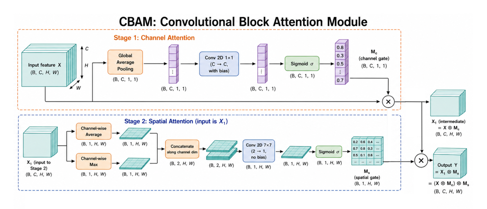
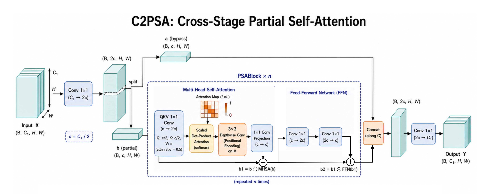
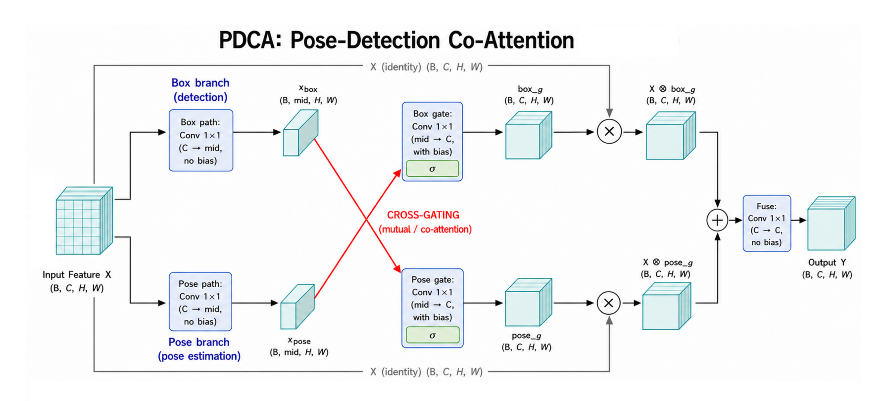

# YoloPose-PDCA

**Pose Detection Co-Attention Based YOLO11m-Pose Enhancement for Correct Assignment Rate and Growing Point Localization**

Code for weed detection and growing-point localization on **CropsOrWeed9**, built on **YOLO11-Pose** with **PDCA** (Pose–Detection Co-Attention).

**Proposed model:** ECA + CBAM + extra C2PSA + PDCA  
**Config:** `configs/combos/yolo11/yolo11m-pose-combo-1-2-4-pdca.yaml`  
**Module code:** `pdca_yolo11/attention_modules.py`

---

## Architecture diagrams

Five figures document the pipeline and attention modules. Add them after the first push.

| Diagram | File (place in `docs/figures/`) |
|---------|----------------------------------|
| PDCA-YOLO11-Pose complete pipeline | `full_pipeline.png` |
| ECA | `eca.png` |
| CBAM | `cbam.png` |
| C2PSA | `c2psa.png` |
| PDCA | `pdca.png` |

See [docs/figures/README.md](docs/figures/README.md) for details.

Once uploaded, they appear here:

<!-- Uncomment after you add the images:


| ECA | CBAM | C2PSA | PDCA |
|-----|------|-------|------|
|  |  |  |  |
-->

---

## Setup

```bash
python -m venv .venv && source .venv/bin/activate
pip install -r requirements.txt
export PYTHONPATH="$(pwd):${PYTHONPATH:-}"
```

## Dataset

CropsOrWeed9 is **not** in this repo (about 11 GB). Put it here:

```
data/CropsOrWeed9/
├── images/{train,val,test}/
├── labels/{train,val,test}/
└── dataset_info.json
```

See [data/README.md](data/README.md) for class list, label format, and how to rebuild from CropAndWeed.

## Train

```bash
# Augmented YOLO11m baseline
python scripts/train_experiment.py --id ladder_baseline

# Proposed model (ECA + CBAM + C2PSA + PDCA)
python scripts/train_experiment.py --id ladder_combo_124_pdca
```

List all experiment IDs:

```bash
python scripts/list_experiments.py
```

## Evaluate

```bash
python scripts/eval_experiment.py --id ladder_combo_124_pdca
python scripts/export_tables.py --group ladder_ablation
```

Metrics are reported for **weed (class 8)** and **overall (9-class macro)** at conf=0.30.

## Reproduce paper experiments

```bash
bash scripts/run_ladder_ablation.sh
bash scripts/run_method_comparison.sh
bash scripts/run_srd_ablation.sh
bash scripts/run_scale_baselines.sh
bash scripts/run_eval_all.sh
```

Or run everything: `bash scripts/run_all.sh`

## Training settings

| Setting | Value |
|---------|-------|
| Image size | 1280 |
| Batch | 8 |
| Epochs | 150 (early stop patience 10) |
| Optimizer | SGD, lr0=0.01 |
| LR schedule | ReduceLROnPlateau (patience 5, factor 0.5) |
| Eval confidence | 0.30 |

## Results

Pre-computed tables: `results/reference/`

## Citation

Please cite the CropAndWeed dataset and your paper if you use this code.
